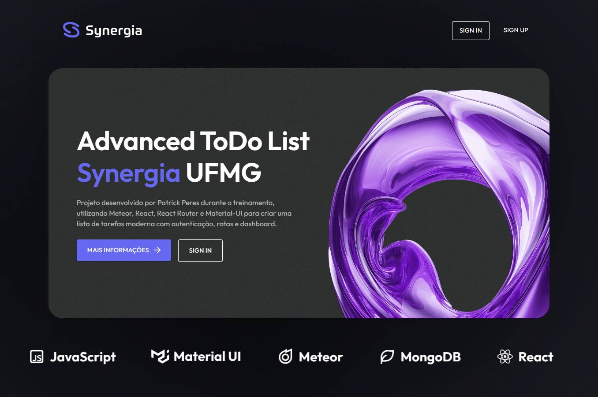
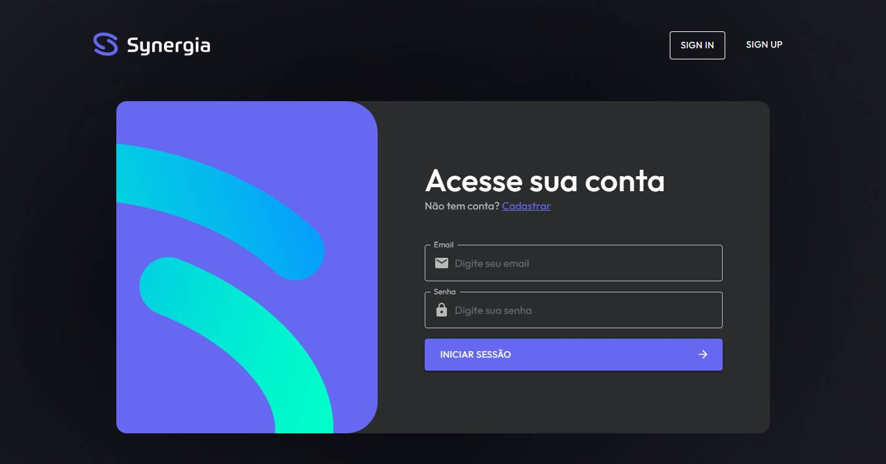
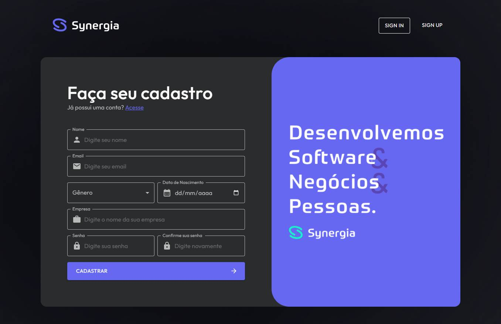
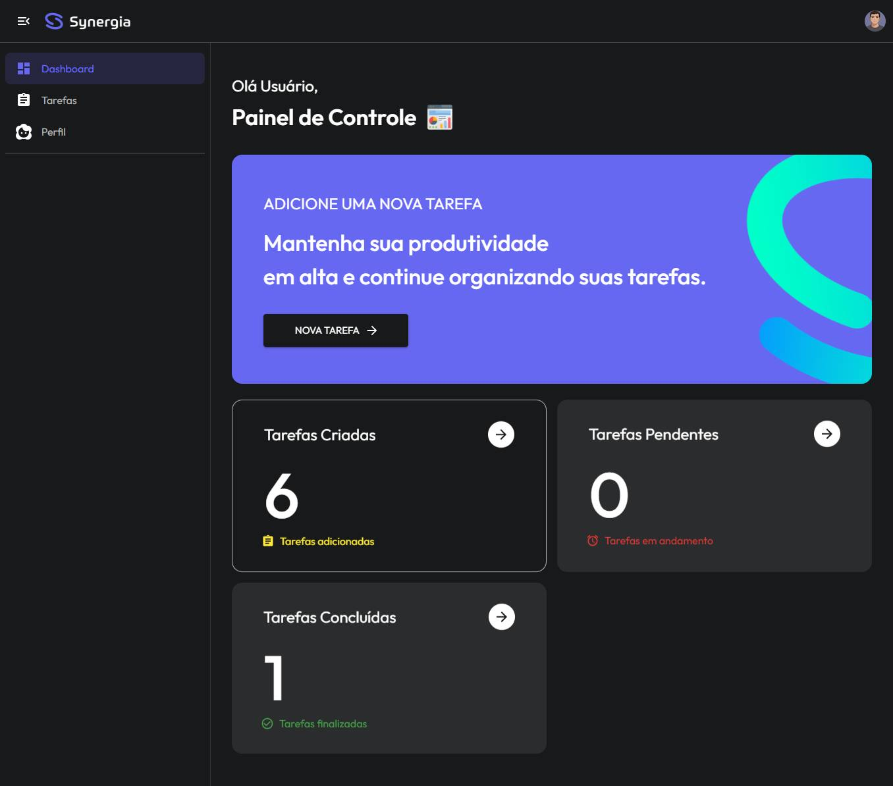
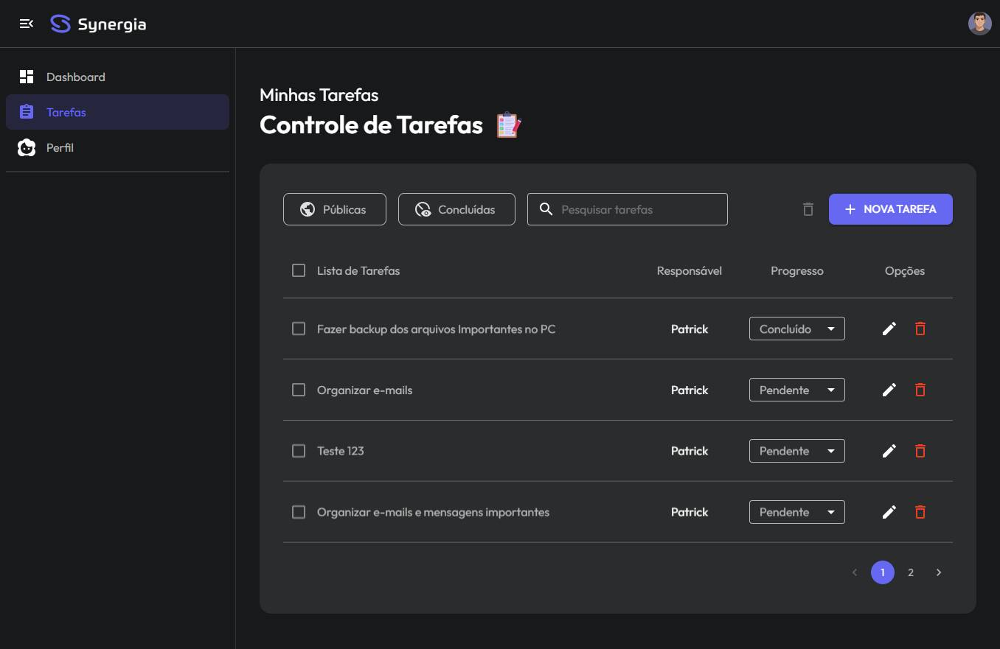
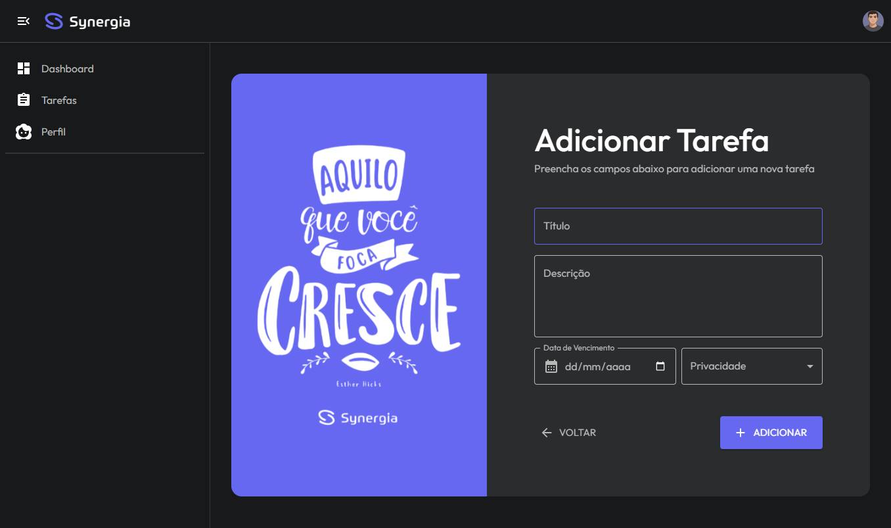
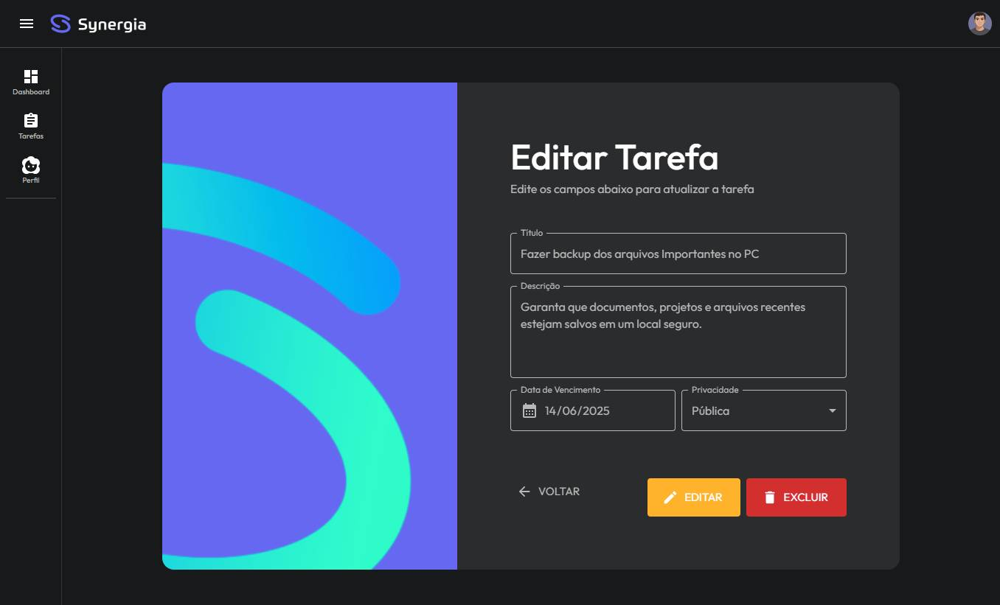

# ✅ Advanced ToDo List

Sistema de gerenciamento de tarefas desenvolvido durante o treinamento interno do Synergia. Este projeto simula um ambiente corporativo real com foco no desenvolvimento full stack de uma aplicação web moderna e funcional.

---

## 📋 Índice

- [Visão Geral](#visao-geral)
- [Tecnologias Utilizadas](#tecnologias-utilizadas)
- [Funcionalidades](#funcionalidades)
- [Demonstração](#demonstracao)
- [Protótipos no Figma](#prototipos-no-figma)
- [Capturas de Tela](#capturas-de-tela)
- [Como Executar o Projeto](#como-executar-o-projeto)
- [Autor](#autor)

---

## 📌 Visão Geral
<a name="visao-geral"></a>

**Advanced ToDo List** é uma aplicação web voltada para a organização de tarefas. Permite que os usuários criem, editem e acompanhem suas tarefas por meio de um painel interativo, com suporte a diferentes estados (em andamento, pendente, concluída).

O projeto foi desenvolvido por **Patrick Peres Nicolini** como parte do programa de formação de desenvolvedores full stack no **Synergia**.

---

## 🧰 Tecnologias Utilizadas
<a name="tecnologias-utilizadas"></a>

> Todas as tecnologias abaixo foram utilizadas no desenvolvimento da aplicação:

<table>
  <tr>
    <td align="center"><br>HTML</td>
    <td align="center"><br>CSS</td>
    <td align="center"><br>JavaScript</td>
    <td align="center"><br>React</td>
    <td align="center"><br>Meteor</td>
    <td align="center"><br>MongoDB</td>
    <td align="center"><br>Git</td>
    <td align="center"><br>Figma</td>
    <td align="center"><br>Material UI</td>
  </tr>
</table>

---

## ✅ Funcionalidades
<a name="funcionalidades"></a>

- Autenticação de usuário (login e cadastro)
- Criação, edição e exclusão de tarefas
- Filtros de status (Em andamento, Concluída, Pendente)
- Dashboard com resumo de tarefas
- Edição de perfil do usuário
- Interface limpa e moderna
- Layout responsivo

---

## 🎥 Demonstração
<a name="demonstracao"></a>

Veja o funcionamento da aplicação em ação:


---

## 🎨 Protótipos no Figma
<a name="prototipos-no-figma"></a>

Veja todos os protótipos utilizados no desenvolvimento da interface:

🔗 [Ver no Figma](https://www.figma.com/design/2hj63cq5DVYWnrshU7OJk2/ToDo-List-UX-Synergia?node-id=24-49&t=8eg5yOwxJIm8QXyl-1)

---

## 🖼 Capturas de Tela
<a name="capturas-de-tela"></a>

> Exemplos de telas da aplicação:

- **Página Inicial**
  

- **Tela de Login**
  

- **Tela de Cadastro**
  

- **Painel de Tarefas**
  

- **Lista de Tarefas**
  

- **Adicionar Tarefa**
  

- **Editar Tarefa**
  

- **Perfil do Usuário**
  

- **404**
  

---

## 🚀 Como Executar o Projeto
<a name="como-executar-o-projeto"></a>

Siga os passos abaixo para rodar o projeto localmente:

1. **Clone o repositório:**

   ```bash
   https://github.com/patricknperes/Advanced-ToDo-List.git
   ```

2. **Acesse a pasta do projeto:**

   ```bash
   cd Advanced-ToDo-List
   ```

3. **Instale as dependências:**

   ```bash
   meteor npm install
   ```

4. **Inicie o servidor de desenvolvimento:**

   ```bash
   meteor
   ```

5. **Abra no navegador:**

   ```
   http://localhost:3000
   ```

---

## 👤 Autor

**Patrick Peres Nicolini**  
Desenvolvedor Full Stack  
[LinkedIn](https://www.linkedin.com/in/patricknperes/)  
[Portfólio](https://patrickportfoliowebsite.netlify.app/)

---

© 2025 Patrick Peres. Todos os direitos reservados.
